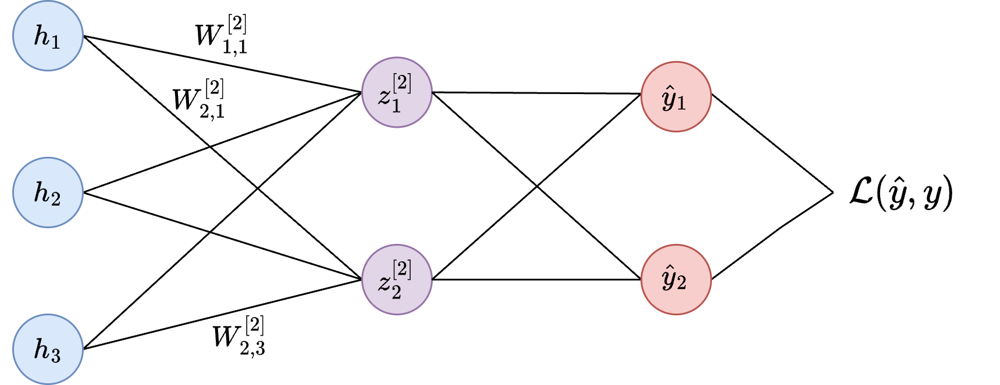

+++
title = 'ML Foundations: Understanding the Math Behind Backpropagation'
slug = 'understanding-the-math-behind-backpropagation'
date = 2024-11-01T00:00:00
draft = false
thumbnail = 'images/full_network_base.png'
+++

The past decade has marked a heyday for neural networks, driving innovations from deep learning advancements to the rise of transformer models that power tools like ChatGPT, Claude, and other large language models. Recently, Geoffrey Hinton was even [awarded the Nobel Prize in Physics](https://www.utoronto.ca/news/geoffrey-hinton-wins-nobel-prize#:~:text=Geoffrey%20Hinton%2C%20a%20University%20Professor,2024%20Nobel%20Prize%20in%20Physics) for his pioneering contributions to neural networks - a testament to the profound impact of these models on both AI and society.

While a variety of powerful libraries, such as PyTorch, TensorFlow, and JAX, have simplified the process of training and deploying neural networks, developing an understanding of their underlying principles remains invaluable. In this post, I’ll guide you through the mathematical underpinnings of backpropagation, a key algorithm for training neural networks, and demonstrate how to implement it from scratch using Python with NumPy. We’ll apply this knowledge to train a simple fully connected neural network for classifying images in the [MNIST dataset](https://www.kaggle.com/datasets/hojjatk/mnist-dataset).

By the end of this post, you can expect to have have a deeper understanding of how neural networks learn and a larger appreciation for the automatic differentiation libraries that handle many of the mathematical details for you. Let's dive in!

<!-- implementing a fully connected neural network to classify images in the [MNIST dataset](https://www.kaggle.com/datasets/hojjatk/mnist-dataset). I'll cover derivations and intuition for the gradient computations in backpropagation and implement everything from scratch using NumPy. Let’s dive in! -->

<!-- Despite the ubiquity of these tools, it's still important to understand the fundamentals of how they work. In this post, I'll walk through the implementation of a simple fully-connected neural network to tackle image classification on the MNIST dataset. We'll implement backpropagation and stochastic gradient descent from scratch using `numpy`, and provide high-level derivations and intuition for computing weight updates of each of the neurons.

Welcome to my very first post of the blog! I wanted to take some time to brush up on ML foundations and what better way to learn (or re-learn) technical topics than to write up one's findings? I'm also hoping that treating these blog posts as final artifacts will be a useful forcing function for actually completing the projects.

Into the meaty content. In this post, I will walk through the implementation of a simple fully-connected neural network to tackle image classification on the [MNIST dataset](https://www.kaggle.com/datasets/hojjatk/mnist-dataset). I will implement backpropagation and stochastic gradient descent from scratch using `numpy` and provide high-level derivations and intuition for computing weight updates of each of the neurons, but I'll try not to get overly academic with it. This was a fun and surprisingly challenging exercise, and it made me even more thankful that mature automatic differentiation libraries like `pytorch` exist - I imagine that manually computing gradients for a 30+ layer ResNet would entail a special kind of masochism. -->

<!-- ## Loading the Dataset

Let's start off by loading the train and test datasets from the `torchvision` python package. While we won't be using `pytorch` for training, we will make use of the `DataLoader` class for sampling minibatches from the training dataset.

```python
from torch.utils.data import DataLoader
from torchvision import datasets, transforms

transform = transforms.Compose([
    transforms.Resize((28, 28)),
    transforms.ToTensor(),  # Ensure fast so no action is needed
])

# Fetch the dataset
train_dataset = datasets.MNIST(root='./data', train=True, transform=transform, download=True)
test_dataset = datasets.MNIST(root='./data', train=False, transform=transform, download=True)

train_loader = DataLoader(train_dataset, batch_size=64, shuffle=True)
test_loader = DataLoader(test_dataset, batch_size=1000, shuffle=False)
```
 -->

## MNIST Digit Classification

<!--  Following this for notation: https://cs230.stanford.edu/files/Notation.pdf -->

Let's begin by laying some notational groundwork for the classification task. As usual for supervised learning problems, we consider the setting where we are provided a dataset $\mathcal{D}$ consisting of input vectors $x$ and label vectors $y$:

$$\mathcal{D} = \bigl\lbrace (x^{(i)}, y^{(i)}) \bigr\rbrace_{i=1}^m \space,$$ 

where $m$ is the number of samples in our dataset. The standard MNIST dataset consists of 60,000 training images and 10,000 test images, which we will call $\mathcal{D_{\text{train}}}$ and $\mathcal{D_{\text{test}}}$. An image can be represented as a column vector:

$$x^{(i)} = [x_1^{(i)}, x_2^{(i)}, ..., x_{n_x}^{(i)}]^T \space,$$

where $n_x = 28 \times 28$ is the number of pixels in each image. Each image has a real-valued label $y^{(i)} \in [0, 9]$ that indicates which digit, or class, the image corresponds to. To help us perform classification, we will represent this as a one-hot encoded vector:

$$y^{(i)} = [y_1^{(i)}, y_2^{(i)}, ..., y_{n_y}^{(i)}]^T \space,$$ where $n_y = 10$ is the number of digits or classes to choose from and 

$$
y_k^{(i)} = \begin{cases}
1 & \text{if class } k \text{ is the correct class}, \\\\\\
0 & \text{otherwise}.
\end{cases}
$$

Below we can see some sample images from this dataset, along with their corresponding labels.

<!-- $$ 
\mathcal{D} = \mathcal{D_{\text{train}}} \cup \mathcal{D_{\text{test}}} = \lbrace (\boldsymbol{x}_i, \boldsymbol{y}_i) \mid i = 1, 2, ..., m \rbrace.
$$ -->


Because we have multiple digits to choose from, we consider this a **multi-class classification** problem, where the goal is roughly to find some function $f(x)$ that is able to correctly determine the labels for as many images in our dataset (or more precisely, our test set) as possible.

## Neural Network Definition

<!-- Most of you are probably familiar enough with neural networks that I can skip a conceptual introduction. Instead, I will move into defining the neural network as a mathematical function, so that we can work with each part for our backprop derivations. -->

In this section, we’ll outline the the mathematical foundation of our neural network model, starting with the classification function $ f(x; \theta) $. This function maps input data $x$ to a predicted class $ \hat{y} $, represented as $ \hat{y} = f(x; \theta) = \arg\max_k f_k(x; \theta) $, where $ f_k(x; \theta) $ denotes the score or probability for class $k$. The neural network’s purpose is to model $f_k(x; \theta)$ with learnable parameters $\theta$ .

<!-- For our MNIST classification task, we’ll build a simple, fully connected neural network with a single hidden layer of 128 units. In this hidden layer, the output $ h(x) $ is calculated as $ h(x) = \sigma (W^{[1]} x + b^{[1]}) $, where $ W^{[1]} $ and $ b^{[1]} $ are the weights and biases for the hidden layer. To output class probabilities, we’ll apply a softmax function to the final layer, providing a normalized probability distribution across the classes, making it ideal for classification. -->

<!-- Let $f(x; \theta)$ be the classification function (model) parameterized by $\theta$, which maps from inputs $x$ to a predicted class $\hat{y}$. This classification function typically takes the..... TODO.... $\hat{y} = f(x; \theta) = \arg\max_c f_k(x; \theta),$ where $f_k(x; \theta)$ is the score or probability for class $c$. This function $f_k$ is what we will be modeling with our neural network. -->

<!-- $$f: \mathbb{R}^{n_x} \rightarrow \mathbb{R}^{n_y}.$$ -->

Neural networks may have an abritrary number of layers - the more layers, the "deeper" the network. The parameters $\theta$ of our model are comprised of **weights** and **biases**, which are denoted using $W^{[l]}$ and $b^{[l]}$ respectively, for each layer $l$. For our MNIST classification problem, we will use a network with a single hidden layer of size 128. The output of this first layer, also known as a **hidden** layer, is:

$$h(x) = \sigma (W^{[1]} x + b^{[1]}),$$

where $W^{[1]} \in \mathbb{R}^{n_h \times n_x}$, $b^{[1]} \in \mathbb{R}^{n_h}$, $n_h = 128$ is the hidden layer size, and $\sigma$ is the sigmoid activation function. To output class probabilities, we’ll apply a softmax function to the final layer, providing a normalized probability distribution across the classes, making it ideal for classification. The softmax function is defined as

<!-- Note that the dimensions of each matrix and vector become quite important during implementation - shape errors tend to be where I spend much of my debugging time in the early stages of development.

For classification problems where a single label is predicted, it is typical to use the softmax function to convert the final layer outputs into a probability distribution: -->

$$\text{softmax}(z) = \frac{e^{z}}{\sum_{k=1}^{C} e^{z}_{k}} \space,$$

where $K = n_y$ is the number of classes. With this, the final output of our neural network becomes:

$$f_k(x; \theta) = \text{softmax} (W^{[2]} h(x) + b^{[2]}),$$

where $W^{[2]} \in \mathbb{R}^{n_y \times n_h}$ and $b^{[2]} \in \mathbb{R}^{n_y}$. Notice that our input $x$ is passed through the hidden layer to produce $h(x)$, which is then passed through the output layer to produce the final class probabilities.

<!-- Fully expanded, the output of our network can be written in a single line as
$$
\begin{equation*}
    f_k(x; \theta) = \text{softmax} \bigl( W^{[2]} \sigma (W^{[1]} x + b^{[1]}) + b^{[2]} \bigr) \space.
\end{equation*}
$$ -->

Pictorally, our neural network can be visualized as follows:


A simple fully-connected neural network with a single hidden layer.


<!-- Our neural network will consist of a single hidden layer, where each node in the hidden layer applies an activation function to a weighted sum of the inputs. The choice of activation function is crucial, as it introduces non-linearity to the model, enabling it to learn complex patterns. -->


<!-- ## Defining the Loss Function -->

<!-- For our classification task, we’ll use the **cross-entropy loss**, which is a common choice for multi-class classification problems. It measures the difference between the predicted probability distribution and the true distribution (one-hot encoded labels for MNIST). The cross-entropy loss for a batch of samples is defined as:

$$
L = - \frac{1}{N} \sum_{n=1}^{N} \sum_{i=1}^{K} y_i^{(n)} \log(\hat{y}_i^{(n)})
$$

### Python Code for Cross-Entropy Loss:
```python
def cross_entropy_loss(y, y_hat):
    # Small epsilon added to avoid log(0)
    epsilon = 1e-12
    y_hat = np.clip(y_hat, epsilon, 1. - epsilon)  # Ensure y_hat is within (0, 1) to prevent log(0)
    
    # Average over the batch
    return -np.sum(y * np.log(y_hat)) / y.shape[0]
```

In this function, we first clip the predicted values y_hat to avoid undefined values from log(0) and then compute the average loss over the batch of examples. -->

## Gradient Descent with Backpropagation

We now have a parameterized model that is capable of representing a variety of functions. Our goal is to find the function which provides the best fit with respect to our dataset $\mathcal{D}$. To accomplish this, we will introduce a **loss function** $\mathcal{L}(\hat{y}, y)$ as a measure of fit, and then *minimize* this function to find the optimal parameters of the model:

$$\theta_* = \arg\min_{\theta} \mathcal{L}(\hat{y}, y).$$

For multi-class classification problems, cross-entropy is a common loss function which measures the distance between the distribution produced by our model, and the true distribution $P(y|x)$. The cross-entropy loss for a tuple $(x, y)$ is defined as:

$$
\begin{equation}
\label{eq:loss}
    \mathcal{L}(\hat{y}, y) = - \sum_{k=1}^{K} y_k \log \hat{y}_k \space.
\end{equation}
$$

<!-- where $K = n_y$ is the number of classes. -->

To solve this optimization problem, we will use **gradient descent** with the **backpropagation** algorithm. At a high level, backpropagation allows us to efficiently compute the derivatives needed to perform gradient updates using the chain rule in calculus. During this process, derivatives from later layers in the network get passed back through previous layers, hence the name!

## Deriving the Backprop Learning Updates

At this point, the fastest way forward would be to use an automatic differentiation library like [PyTorch](https://pytorch.org/) to handle all the gradient computations and not muddle ourselves in all the mathematical details. But where would be the fun in that? Let's go ahead and derive the gradient descent updates ourselves.

Updating parameters $\theta$ at each iteration of gradient descent is a matter of taking a step in the direction of steepest descent in the loss function, with step size $\alpha$:

$$ \theta \leftarrow \theta - \alpha \nabla \mathcal{L}(\theta).$$

Breaking down the gradient by each set of weights and biases in our network, we arrive at the following four update expressions:

$$
\begin{align*}
W^{[1]} & \leftarrow W^{[1]} - \alpha \frac{\partial \mathcal{L}}{\partial W^{[1]}} \\\\\\
b^{[1]} & \leftarrow b^{[1]} - \alpha \frac{\partial \mathcal{L}}{\partial b^{[1]}} \\\\\\
W^{[2]} & \leftarrow W^{[2]} - \alpha \frac{\partial \mathcal{L}}{\partial W^{[2]}} \\\\\\
b^{[2]} & \leftarrow b^{[2]} - \alpha \frac{\partial \mathcal{L}}{\partial b^{[2]}}\space.
\end{align*}
$$

It's important to remember that $W^{[l]}$ is a *matrix* and $b^{[l]}$ is a *vector*, so the result of the gradients here will be either a matrix or vector as well. The components of these gradient objects are the partial derivative with respect to *each individual weight*. That is,

$$
\begin{equation*}
\label{eq:jacobian}
\frac{\partial \mathcal{L}}{\partial W^{[l]}} = 
\begin{bmatrix}
    \frac{\partial \mathcal{L}}{\partial W_{1,1}^{[l]}} & \frac{\partial \mathcal{L}}{\partial W_{1,2}^{[l]}} & \cdots & \frac{\partial \mathcal{L}}{\partial W_{1,n_{l-1}}^{[l]}} \\\\\\ 
    \frac{\partial \mathcal{L}}{\partial W_{2,1}^{[l]}} & \frac{\partial \mathcal{L}}{\partial W_{2,2}^{[l]}} & \cdots & \frac{\partial \mathcal{L}}{\partial W_{2,n_{l-1}}^{[l]}} \\\\\\ 
    \vdots & \vdots & \ddots & \vdots \\\\\\
    \frac{\partial \mathcal{L}}{\partial W_{n_l,1}^{[l]}} & \frac{\partial \mathcal{L}}{\partial W_{n_l,2}^{[l]}} & \cdots & \frac{\partial \mathcal{L}}{\partial W_{n_l,n_{l-1}}^{[l]}} \\\\\\ 
\end{bmatrix},
\end{equation*}
$$

where $n_l$ and $n_{l-1}$ are the number of neurons in layers $l$ and $l-1$, respectively.

<!-- $$
    W_{11}^{[1]} + W_{12}^{[1]}
$$ -->

<!-- Because of several factors, namely the non-convexity of the loss function, the large number of parameters, and non-linear activations, it is typically infeasible to find the global minima of $\mathcal{L}(x, \theta)$ by simply solving for $\nabla \mathcal{L} = 0$. Instead, we can estimate the minima using **gradient descent**, which is an iterative algorithm that I'm sure you've heard of if you've reached this point in the article. How does **backpropagation** fit into this? -->

### Forward Pass

To begin with an iteration of backpropogation, we first do a **forward pass**, where we pass an input $x$ through the network. During the forward pass, we compute outputs at each layer of the network, and store some which will be used later during the backward pass. We introduce the variable $z^{[l]}$ as well, to aid us during the backward pass:

$$
\begin{align*}
    z^{[1]} &= W^{[1]} x + b^{[1]} \\\\\\
    h &= \sigma(z^{[1]}) \\\\\\
    z^{[2]} &= W^{[2]} h + b^{[2]} \\\\\\
    \hat{y} &= \text{softmax}(z^{[2]}).
\end{align*}
$$

At this stage, it is helpful if we visualize how all of these outputs and parameters fit together. For simplicity, we'll consider a network with just a few neurons:

<!--  -->
<!-- 
{width=500 alt="Gravel Calls" class="center"} -->

### Backward Pass

For our **backward pass**, we will compute the partial derivatives needed for our learning update. Conceptually, we can think of this as figuring out how much a change in each weight contributes to a change in the overall loss. To determine derivatives for weights in earlier layers in the network, we use the [chain rule](https://en.wikipedia.org/wiki/Chain_rule) to decompose the derivatives into parts, which enables re-use of derivatives that were computed for later layers; this is essentially dynamic programming. Let's start by computing derivatives $\frac{\partial \mathcal{L}}{\partial W_{j,i}^{[l]}}$ for weights in the output layer, and then move on to the hidden layer.

### Output Layer Derivatives

 It is helpful to start by visualizing the output layer of our network, to understand how the weights and biases connect with the loss function. We will be using $j$ to index neurons in the output layer, and $i$ to index neurons in the hidden layer. So $W_{2,1}^{[2]}$ indicates the weight connecting neuron $1$ in $h$ and neuron $2$ in $z^{[2]}$:



We first notice that $\mathcal{L}$ is a function of $z_j^{[l]}$ and use the chain rule to re-express our derivative:

$$
    \frac{\partial \mathcal{L}}{\partial W_{j,i}^{[2]}} = \frac{\partial \mathcal{L}}{\partial z_j^{[2]}} \frac{\partial z_j^{[2]}}{\partial W_{j,i}^{[2]}}.
$$

This $\frac{\partial \mathcal{L}}{\partial z_j^{[2]}}$ term is important, as we'll be re-using it later to compute derivatives in the earlier hidden layer. To solve for this quantity, you might think (as I did) that the same pattern could be applied when decomposing by $\hat{y}$, but interestingly, this is not the case:

$$
    \frac{\partial \mathcal{L}}{\partial z_j^{[2]}} \neq \frac{\partial \mathcal{L}}{\partial \hat{y_j}} \frac{\partial \hat{y_j}}{\partial z_j^{[2]}} \space.
$$

The reason for this is related to our usage of the $\text{softmax}$ function over our outputs $z_j^{[l]}$. Because $\text{softmax}$ causes $z_j^{[l]}$ to have an effect on both $\hat{y}_1$ and $\hat{y}_2$, we need to take both of these "paths" into account when applying the chain rule.

<!-- {{< figure src="/images/output_layer_highlighted.png" caption="The path that W_{1,1}^{[2]} takes through to $\mathcal{L}$." class="center" >}} -->


The path that $W_{1,1}^{[2]}$ takes to reach $\mathcal{L}$. Notice that the computation flows through all nodes in $\hat{y}$.


So in this case, we need to apply the **multivariable chain rule** by *summing* the derivatives of each path:

$$
    \frac{\partial \mathcal{L}}{\partial z_j^{[2]}} = \sum_{k=1}^{K} \frac{\partial \mathcal{L}}{\partial \hat{y_k}} \frac{\partial \hat{y_k}}{\partial z_j^{[2]}} \space.
$$

As we'll see, it is also useful to split this expression into cases where $j=k$ and $j \neq k$:

$$
\begin{equation}
\label{eq:dldz2_expanded}
    \frac{\partial \mathcal{L}}{\partial z_j^{[2]}} = \frac{\partial \mathcal{L}}{\partial \hat{y_k}} \frac{\partial \hat{y_k}}{\partial z_k^{[2]}} + \sum_{k \neq j} \frac{\partial \mathcal{L}}{\partial \hat{y_k}} \frac{\partial \hat{y_k}}{\partial z_j^{[2]}}\space.
\end{equation}
$$

Our final expression for the derivative of the loss with respect to a single weight in the output layer then becomes

<!-- $$
\begin{equation}
\label{eq:dldw2}
    \frac{\partial \mathcal{L}}{\partial W_{j,i}^{[2]}} = \sum_{k=1}^K \frac{\partial \mathcal{L}}{\partial \hat{y_k}} \frac{\partial \hat{y_k}}{\partial z_j^{[2]}} \frac{\partial z_j^{[2]}}{\partial W_{j,i}^{[2]}}\space.
\end{equation}
$$

As we'll see, it is also useful to split this expression into cases where $j=k$ and $j \neq k$: -->

$$
\begin{equation}
\label{eq:dldw2_expanded}
    \frac{\partial \mathcal{L}}{\partial W_{j,i}^{[2]}} = \frac{\partial \mathcal{L}}{\partial \hat{y_k}} \frac{\partial \hat{y_k}}{\partial z_k^{[2]}} \frac{\partial z_k^{[2]}}{\partial W_{j,i}^{[2]}} + \sum_{k \neq j} \frac{\partial \mathcal{L}}{\partial \hat{y_k}} \frac{\partial \hat{y_k}}{\partial z_j^{[2]}} \frac{\partial z_j^{[2]}}{\partial W_{j,i}^{[2]}}\space.
\end{equation}
$$

Let's go ahead and solve this expression, one term at a time.

#### Solving Individual Derivatives

For the first derivative term in Equation \ref{eq:dldw2_expanded}, we can take the derivative of the loss with respect to $\hat{y}_k$ by noting that the derivative is zero for each term in the sum, save for the case where $u=k$:

$$
\begin{align}
    \frac{\partial \mathcal{L}}{\partial \hat{y_k}} &= \frac{\partial}{\partial \hat{y_k}} \bigl( - \sum_{u=1}^{K} y_u \log \hat{y}_u \bigr) \nonumber \\\\\\
    &= -y_k \frac{\partial}{\partial \hat{y_k}} \log \hat{y_k} \nonumber \\\\\\
    &= -\frac{y_k}{\hat{y}_k}\space.
\end{align}
$$

Solving the $\frac{\partial \hat{y}_k}{\partial z_j^{[2]}}$ term is a bit more involved, and so we'll leave out an in-depth derivation here. If you'd like to dig into the nitty gritty here, a full derivation is provided in [Appendix: Softmax Gradient Derivation](#softmax-gradient-derivation). For now, just note that you can use the [quotient rule](https://en.wikipedia.org/wiki/Quotient_rule), along with splitting into different cases to solve. In the end, we find the solution to be the following piecewise function:

$$
\begin{equation}
\frac{\partial \hat{y}_k}{\partial z_j^{[2]}} =
\begin{cases}
\hat{y}_k \left( 1 - \hat{y}_k \right), & \text{if } j = k \\\\\\
-\hat{y}_j \hat{y}_k, & \text{if } j \neq k \space.
\end{cases}
\end{equation}
$$

For the third term, again we note that the derivative is zero for each term in $W^{[2]} h$, except for $W_{j,i}^{[2]} h_i$:

$$
\begin{align}
    \frac{\partial z_j^{[2]}}{\partial W_{j,i}^{[2]}} &= \frac{\partial }{\partial W_{j,i}^{[2]}} \bigl( W^{[2]} h + b^{[2]} \bigr) \nonumber \\\\\\
    &= \frac{\partial }{\partial W_{j,i}^{[2]}} W_{j,i}^{[2]} h_i \nonumber \\\\\\
    &= h_i \space.
\end{align}
$$

#### Putting it Together

Plugging each of these results first into Equation \ref{eq:dldz2_expanded} we get

$$
\begin{align}
\frac{\partial \mathcal{L}}{\partial z_j^{[2]}} &= \biggl(-\frac{y_j}{\hat{y_j}} \biggr) \biggl( \hat{y_j} (1 - \hat{y_j}) \biggr) + \sum_{k \neq j} \biggl(-\frac{y_k}{\hat{y_k}} \biggr) \biggl( -\hat{y_j} \hat{y_k} \biggr) \nonumber \\\\\\
&= -y_j + y_j \hat{y_j} + \hat{y_j} \sum_{k \neq j} y_k  \nonumber \\\\\\
&= -y_j + \hat{y_j} \underbrace{\biggl(y_j + \sum_{k \neq j} y_k \biggr)}_{=1} \nonumber \\\\\\
&= \hat{y_j} - y_j \space. \label{eq:dl_dz2_final}
\end{align}
$$

Now solving for $\frac{\partial \mathcal{L}}{\partial W_{j,i}^{[2]}}$ by plugging in the results above, we get

$$
\begin{align}
\frac{\partial \mathcal{L}}{\partial W_{j,i}^{[2]}} &= \\frac{\partial \mathcal{L}}{\partial z_j^{[2]}} \frac{\partial z_k^{[2]}}{\partial W_{j,i}^{[2]}} \nonumber \\\\\\
&= \bigl(\hat{y_j} - y_j \bigr) h_i \space.
\end{align}
$$

 That took a bit of work, but we now see that the derivative of the loss with respect to a single weight in the output layer is equal to the value of the input neuron $h_i$ times the difference between the predicted output $\hat{y_j}$ and ground truth $y_j$. Pretty cool!

#### The Bias Term

We're almost done with the output layer, but we still need to solve for the derivative of the loss with respect to the bias term. Again we can use the chain rule to decompose the derivative:

$$
\begin{equation*}
    \frac{\partial \mathcal{L}}{\partial b_{j,i}^{[2]}} = \frac{\partial \mathcal{L}}{\partial z_j^{[2]}} \frac{\partial z_j^{[2]}}{\partial b_{j,i}^{[2]}}\space.
\end{equation*}
$$

We already know the solution for the first term here. Solving for the second term,

$$
\begin{align*}
    \frac{\partial z_j^{[2]}}{\partial b_{j,i}^{[2]}} &= \frac{\partial }{\partial b_{j,i}^{[2]}} \bigl( W^{[2]} h + b^{[2]} \bigr) \nonumber \\\\\\
    &= \frac{\partial }{\partial b_{j,i}^{[2]}} b_{j,i}^{[2]} \nonumber \\\\\\
    &= 1 \space,
\end{align*}
$$

such that
$$
\begin{align}
    \frac{\partial \mathcal{L}}{\partial b_{j,i}^{[2]}} &= \hat{y_j} - y_j \space.
\end{align}
$$

### Hidden Layer Derivatives

Now that we've solved for the output layer, we can move on to the hidden layer. The process is similar, except we'll now be passing derivatives computed in the output layer back to the hidden layer - finally some backpropagation! Looking at the full network, we can see how the effect of the hidden layer's weights flow through the network:


The path that $W_{1,1}^{[1]}$ takes to reach $\mathcal{L}$.


 We can start by decomposing the derivative of the loss with respect to the weights in the hidden layer, using the chain rule once again:

<!-- $$
\begin{align}
    \frac{\partial \mathcal{L}}{\partial W_{j,i}^{[1]}} &= \frac{\partial \mathcal{L}}{\partial h_j} \frac{\partial h_j}{\partial z_j^{[1]}} \frac{\partial z_j^{[1]}}{\partial W_{j,i}^{[1]}} \nonumber \\\\\\
    &= \frac{\partial \mathcal{L}}{\partial z_j^{[2]}} \frac{\partial z_j^{[2]}}{\partial h_j} \frac{\partial h_j}{\partial z_j^{[1]}} \frac{\partial z_j^{[1]}}{\partial W_{j,i}^{[1]}} \space.
\end{align}
$$ -->

$$
\begin{align}
    \frac{\partial \mathcal{L}}{\partial W_{j,i}^{[1]}} &= \frac{\partial \mathcal{L}}{\partial h_j} \frac{\partial h_j}{\partial z_j^{[1]}} \frac{\partial z_j^{[1]}}{\partial W_{j,i}^{[1]}} \space. \nonumber
\end{align}
$$

Here we use $i$ to index neurons in the input and $j$ to index neurons in the hidden layer, and we can solve for each of these derivatives in a similar manner to the output layer.

#### Solving Individual Terms

For the first term, notice that we need to sum over all paths from $h_j$ to $\mathcal{L}$,

$$
\frac{\partial \mathcal{L}}{\partial h_j} = \sum_{k=1}^{K} \frac{\partial \mathcal{L}}{\partial z_k^{[2]}} \frac{\partial z_k^{[2]}}{\partial h_j} \space.
$$

Since $z_k^{[2]} = \sum_{j=1}^{n_h} W_{k,j}^{[2]} h_j + b_k^{[2]}$, we have

$$
\frac{\partial z_k^{[2]}}{\partial h_j} = W_{k,j}^{[2]}.
$$

Here we notice that the $\frac{\partial \mathcal{L}}{\partial z_k^{[2]}}$ term is exactly the result we computed in Equation \ref{eq:dl_dz2_final} for the output layer. *Propagating* this derivative *backwards* through the network to the hidden layer, we find that

$$
\begin{equation}
\frac{\partial \mathcal{L}}{\partial h_j} = \sum_{k=1}^{K} (\hat{y_k} - y_k) W_{k,j}^{[2]} \space.
\end{equation}
$$

Solving for the second term $\frac{\partial h_j}{\partial z_j^{[1]}}$ is straightforward, as the derivative of the sigmoid function $\sigma$ is simply $\sigma(1 - \sigma)$. Thus,

$$
\begin{align}
    \frac{\partial h_j}{\partial z_j^{[1]}} &= \sigma(z_j^{[1]}) (1 - \sigma(z_j^{[1]})) \nonumber \\\\\\
    &= h_j (1 - h_j) \space.
\end{align}
$$

Finally, the third term is the same as before, where the derivative is zero for all terms except for $W_{j,i}^{[1]} x_i$:

$$
\begin{align}
    \frac{\partial z_j^{[1]}}{\partial W_{j,i}^{[1]}} &= \frac{\partial }{\partial W_{j,i}^{[1]}} \bigl( W^{[1]} x + b^{[1]} \bigr) \nonumber \\\\\\
    &= \frac{\partial }{\partial W_{j,i}^{[1]}} W_{j,i}^{[1]} x_i \nonumber \\\\\\
    &= x_i \space.
\end{align}
$$

#### Putting it Together

Plugging these results back into our original expression, we find that the derivative of the loss with respect to a single weight in the hidden layer is

$$
\begin{align}
    \frac{\partial \mathcal{L}}{\partial W_{j,i}^{[1]}} &= \biggl[ \sum_{k=1}^{K} (\hat{y_k} - y_k) W_{k,j}^{[2]} \biggr] h_j (1 - h_j) x_i \space.
\end{align}
$$

And similarly for the bias terms, we find that

$$
\begin{align}
    \frac{\partial \mathcal{L}}{\partial b_{j,i}^{[1]}} &= \biggl[ \sum_{k=1}^{K} (\hat{y_k} - y_k) W_{k,j}^{[2]} \biggr] h_j (1 - h_j) \space.
\end{align}
$$

### Summary

We've now solved for the derivatives of the loss with respect to each weight and bias in our network. We can now use these results to update the parameters of our model using gradient descent! Collecting the derivatives for each set of parameters, we have

$$
\begin{align*}
    \frac{\partial \mathcal{L}}{\partial W_{j,i}^{[1]}} &= \biggl[ \sum_{k=1}^{K} (\hat{y_k} - y_k) W_{k,j}^{[2]} \biggr] h_j (1 - h_j) x_i \\\\\\
    \frac{\partial \mathcal{L}}{\partial b_{j,i}^{[1]}} &= \biggl[ \sum_{k=1}^{K} (\hat{y_k} - y_k) W_{k,j}^{[2]} \biggr] h_j (1 - h_j) \\\\\\
    \frac{\partial \mathcal{L}}{\partial W_{j,i}^{[2]}} &= (\hat{y_j} - y_j) h_i \\\\\\
    \frac{\partial \mathcal{L}}{\partial b_{j,i}^{[2]}} &= \hat{y_j} - y_j \space.
\end{align*}
$$

In vectorized form, we can express these individual parameter derivatives over the full gradient objects:

$$
\begin{align*}
    \frac{\partial \mathcal{L}}{\partial W^{[1]}} &= x^T \bigl[ \bigl( (\hat{y} - y) W^{[2]} \bigr) \odot h \odot (1 - h) \bigr] \\\\\\
    \frac{\partial \mathcal{L}}{\partial b^{[1]}} &= (\hat{y} - y) W^{[2]} \odot h \odot (1 - h) \\\\\\
    \frac{\partial \mathcal{L}}{\partial W^{[2]}} &= h^T (\hat{y} - y) \\\\\\
    \frac{\partial \mathcal{L}}{\partial b^{[2]}} &= \hat{y} - y \space,
\end{align*}
$$

where the hadamard product $\odot$ allows us to vectorize the expression using element-wise multiplication.

<!-- Finally, since gradient descent is typically performed over mini-batches[^1], we can average these gradients over the batch size to get the final gradient updates:

$$
\begin{align*}
    \frac{\partial \mathcal{L}}{\partial W^{[1]}} &= \frac{1}{N} X^T \bigl[ \bigl( (\hat{y} - y) W^{[2]} \bigr) \odot h \odot (1 - h) \bigr] \\\\\\
    \frac{\partial \mathcal{L}}{\partial b^{[1]}} &= \frac{1}{N} \sum \bigl( (\hat{y} - y) W^{[2]} \bigr) \odot h \odot (1 - h) \\\\\\
    \frac{\partial \mathcal{L}}{\partial W^{[2]}} &= \frac{1}{N} h^T (\hat{y} - y) \\\\\\
    \frac{\partial \mathcal{L}}{\partial b^{[2]}} &= \frac{1}{N} \sum (\hat{y} - y) \space.
\end{align*}
$$ -->

You might be suspecting this, but given the repetitive structure of neural networks, the gradients that we computed here can be expressed in a general form for any layer $l$ in a network. We'll leave this as an exercise for the reader, but suffice to say that the derivations we've done here provide the foundation for training neural networks of any depth.

## Python Implementation

Okay enough math, let's get back to the task we set out to tackle: training a neural network on the MNIST dataset. For this purpose, we'll implement a simple feedforward neural network with a single hidden layer, using the sigmoid activation function and softmax output layer. Here's the Python code for our network:

```python
import numpy as np

def sigmoid(z):
    return 1 / (1 + np.exp(-z))

def sigmoid_derivative(z):
    return sigmoid(z) * (1 - sigmoid(z))

def softmax(z):
    exp_z = np.exp(z - np.max(z, axis=1, keepdims=True))  # Subtract max(z) for numerical stability
    return exp_z / exp_z.sum(axis=1, keepdims=True)

class FCNetwork():
    """Single hidden layer network"""
    def __init__(self, input_dim, hidden_dim, output_dim, activation=sigmoid):
        self.w1 = np.random.randn(input_dim, hidden_dim) * np.sqrt(1. / input_dim) # d x h
        self.w2 = np.random.randn(hidden_dim, output_dim) * np.sqrt(1. / hidden_dim) # h x 10
        self.b1 = np.random.rand(1, hidden_dim) # 1 x h
        self.b2 = np.random.rand(1, output_dim) # 1 x 10
        self.activation = activation

    def forward(self, X):
        batch_size = X.shape[0]
        X = X.reshape((batch_size, -1))
        z1 = np.dot(X, self.w1) + self.b1
        h = self.activation(z1)
        z2 = np.dot(h, self.w2) + self.b2
        f_k = softmax(z2)
        return z1, h, z2, f_k
    
    def predict(self, X):
        _, _, _, f_k = self.forward(X)
        y_hat = np.argmax(f_k, axis=1)
        return y_hat

    def compute_grad(self, X, y, y_hat, z1, a1, z2):
        batch_size = X.shape[0]
        X = X.reshape((batch_size, -1))

        # Output layer grads
        dz2 = y_hat - y
        dw2 = np.dot(a1.T, dz2)
        db2 = np.sum(dz2, axis=0, keepdims=True) / batch_size # sum over sammples

        # Hidden layer grads 
        dz1 = np.dot(dz2, self.w2.T) * sigmoid_derivative(z1)
        dw1 = np.dot(X.T, dz1)
        db1 = np.sum(dz1, axis=0, keepdims=True) / batch_size # sum over sammples

        return dw1, db1, dw2, db2
    
    def update_weights(self, dw1, db1, dw2, db2, lr):
        self.w1 -= lr * dw1
        self.b1 -= lr * db1
        self.w2 -= lr * dw2
        self.b2 -= lr * db2
```

The gradients computed in the `compute_grad` method are the same as the ones we derived, but modified slightly to work with mini-batches[^1] of dataset tuples. These batch updates are accomplished by averaging the gradients over each mini-batch, which helps to stabilize the learning process.

Also note the initialization scheme used for the weights, which is known as [Xavier initialization](http://proceedings.mlr.press/v9/glorot10a/glorot10a.pdf). This initialization scheme helps to prevent the gradients from vanishing or exploding during training, which can be a common issue in deep networks. In practice, I found that a basic initialization which sampled from a Gaussian with mean 0 and standard deviation of 1 caused learning to fail, but using Xavier initialization fixed the issue.

### Evaluating Performance

After training the model, we want to evaluate how well it generalizes to unseen data (our validation/test set). We can accomplish this using the **accuracy** metric, which is the percentage of correctly predicted examples. We'll also track the *training loss* to monitor the model's learning progress:

```python
def cross_entropy_loss(y, y_hat):
    # Small epsilon added to avoid log(0)
    epsilon = 1e-12
    y_hat = np.clip(y_hat, epsilon, 1. - epsilon)  # Ensure y_hat is within (0, 1) to prevent log(0)
    
    # Compute cross-entropy
    return -np.sum(y * np.log(y_hat)) / y.shape[0]  # Average over the batch

def evaluate(model, data_loader):
    total_loss = 0
    correct = 0
    for X_val, y_val in data_loader:
        _, _, _, y_pred = model.forward(X_val)
        y_onehot = np.eye(10)[y_val]
        loss = cross_entropy_loss(y_onehot, y_pred)
        total_loss += loss

        y_pred_classes = np.argmax(y_pred, axis=1)
        y_true = np.argmax(y_onehot, axis=1)
        correct += np.sum(y_pred_classes == y_true)
   
    accuracy = correct / len(data_loader.dataset)
    avg_loss = total_loss / len(data_loader)
    return accuracy, avg_loss
```

Here, we convert the one-hot encoded labels and predictions into their respective class indices using `np.argmax`, and then compute the percentage of correctly predicted examples.

### Training the Model

We can now tie everything together in a training loop. The model will iterate over the training data, compute the loss, backpropagate the errors, and update its parameters. After each epoch, we evaluate the model on the test set to monitor its performance:

```python
def train(train_loader: DataLoader, test_loader: DataLoader):
    # Initialize the weights
    lr = 0.01
    input_dim = 28 * 28
    hidden_dim = 256
    output_dim = 10
    model = FCNetwork(input_dim, hidden_dim, output_dim)
    
    NUM_EPOCHS = 20
    VAL_INTERVAL = 1
    for epoch in range(NUM_EPOCHS):
        train_loss = 0
        for batch_idx, (x, y) in enumerate(train_loader):
            y_onehot = np.eye(output_dim)[y]

            # Forward pass
            z1, h, z2, f_k = model.forward(x)
            loss = cross_entropy_loss(y_onehot, f_k)
            train_loss += loss 
            
            # Backward pass
            dw1, db1, dw2, db2 = model.compute_grad(x, y_onehot, f_k, z1, h, z2)
            model.update_weights(dw1, db1, dw2, db2, lr)

        # Compute average training loss across minibatches
        avg_train_loss = train_loss / len(train_loader)
        
        # Evaluate on validation set every VAL_INTERVAL epochs
        if (epoch + 1) % VAL_INTERVAL == 0:
            val_acc, val_loss = evaluate(model, test_loader)
            print(f"Epoch {epoch}, Train Loss: {avg_train_loss:.4f}, Validation Accuracy: {val_acc:.4f}, Validation Loss: {val_loss:.4f}")
        else:
            print(f"Epoch {epoch}, Training Loss: {avg_train_loss:.4f}")

    return model
```

Now, it's simply a matter of loading the MNIST dataset, and calling the `train` function to train the model:

```python
from torch.utils.data import DataLoader
from torchvision import datasets, transforms

transform = transforms.Compose([
    transforms.Resize((28, 28)),
    transforms.ToTensor(),  # Ensure fast so no action is needed
])

# Fetch the dataset
train_dataset = datasets.MNIST(root='./data', train=True, transform=transform, download=True)
test_dataset = datasets.MNIST(root='./data', train=False, transform=transform, download=True)

train_loader = DataLoader(train_dataset, batch_size=64, shuffle=True)
test_loader = DataLoader(test_dataset, batch_size=1000, shuffle=False)

train(train_loader, test_loader)
```

And that's it! We've implemented a feedforward neural network from scratch and trained it on the MNIST dataset. The model should achieve an accuracy of roughly 98% on the test set after 20 epochs, which is quite impressive for such a simple model.

<!-- ## Debugging

Training a neural network from scratch can often result in a few hiccups along the way, including issues like vanishing gradients, slow convergence, or poor generalization. A few debugging tips:

Check the learning rate: If the model is not improving, the learning rate may be too high or too low.
Inspect gradients: If the weights are not updating properly, inspect the gradients and make sure they are neither too large nor vanishingly small.
Try different activations: Sigmoid can suffer from saturation in deep networks. Experiment with ReLU or Leaky ReLU if needed. -->

## Conclusion

In this post, we've covered the basics of implementing a neural network from scratch. We carefully calculated the gradients for a simple feedforward neural network with a single hidden layer, and implemented the model in Python using NumPy. We then trained the model on the MNIST dataset and achieved 98% accuracy using the gradients we manually derived. For a more intuitive, visual walkthrough of backpropagation, I highly recommend the [What is backpropagation really doing?](https://youtu.be/Ilg3gGewQ5U?si=RtR800MxuAhM5gn-) video by 3Blue1Brown.

Hopefully this post has given you a better understanding of how neural networks work under the hood. Stay tuned for more posts on foundations of machine learning, or maybe pictures of my latest sourdough loaf. Until next time!

## Appendix

### Softmax Gradient Derivation

To solve for $\frac{\partial \hat{y_k}}{\partial z_j^{[2]}}$, we need to consider both cases where $j=k$ and where $j \neq k$.

For the case when $j = k$:

$$
\frac{\partial \hat{y_k}}{\partial z_j^{[2]}} = \frac{\partial}{\partial z_j^{[2]}} \biggl( \frac{e^{z_k^{[2]}}}{\sum_{t=1}^{K} e^{z_t^{[2]}}} \biggr)
$$

Using the [quotient rule](https://en.wikipedia.org/wiki/Quotient_rule), where $u = e^{z_k^{[2]}}$ and $v = \sum_{t=1}^{K} e^{z_t^{[2]}}$:

$$
\frac{\partial \hat{y}_k}{\partial z_j^{[2]}} = \frac{(v \cdot \frac{\partial u}{\partial z_j^{[2]}} - u \cdot \frac{\partial v}{\partial z_j^{[2]}})}{v^2}
$$

Since $u = e^{z_k^{[2]}}$, we have:

$$
\frac{\partial u}{\partial z_j^{[2]}} = \frac{\partial e^{z_k^{[2]}}}{\partial z_j^{[2]}} = 
\begin{cases}
e^{z_k^{[2]}}, & \text{if } j = k \\\\\\
0, & \text{if } j \neq k
\end{cases}
$$

Also, since $v = \sum_{t=1}^{K} e^{z_t^{[2]}}$, we have:

$$
\frac{\partial v}{\partial z_j^{[2]}} = \frac{\partial}{\partial z_j^{[2]}} \sum_{t=1}^{n} e^{z_t^{[2]}} = e^{z_j^{[2]}}
$$

Substituting these into the quotient rule:

<!-- $$
\frac{\partial \hat{y_k}}{\partial z_j^{[2]}} = \frac{(\sum_{j=1}^{n} e^{z_j} \cdot e^{z_i} ) - e^{z_i} \cdot e^{z_j^{[2]}}}{(\sum_{j=1}^{n} e^{z_j})^2}
$$ -->

$$
\frac{\partial \hat{y_k}}{\partial z_j^{[2]}} = \frac{\Bigl(\sum_{t=1}^{n} e^{z_t^{[2]}}  \cdot e^{z_k^{[2]}} \Bigr) - e^{z_k^{[2]}} \cdot e^{z_j^{[2]}}} {\Bigl(\sum_{t=1}^{n} e^{z_t^{[2]}} \Bigr)^2},
$$

which simplifies to

$$
\begin{equation*}
\frac{\partial \hat{y_k}}{\partial z_j^{[2]}} = \hat{y}_k \left( 1 - \hat{y}_k \right)
\end{equation*}
$$

When $j \neq k$, the derivation is similar, but in this case, the term $ \frac{\partial u}{\partial z_j^{[2]}} = 0 $, because $u = e^{z_k^{[2]}}$ and $j \neq k$. We still have

$$
\frac{\partial \hat{y_k}}{\partial z_j^{[2]}} = \frac{- e^{z_k^{[2]}} \cdot e^{z_j^{[2]}}} {\Bigl(\sum_{t=1}^{n} e^{z_t^{[2]}} \Bigr)^2},
$$

which simplifies to

$$
\begin{equation*}
\frac{\partial \hat{y}_k}{\partial z_j^{[2]}} = -\hat{y}_j \hat{y}_k
\end{equation*}
$$

Thus, we can express the derivative of the softmax output $\hat{y}_k$ with respect to $z_j^{[2]}$ with

$$
\begin{equation*}
\frac{\partial \hat{y}_k}{\partial z_j^{[2]}} =
\begin{cases}
\hat{y}_k \left( 1 - \hat{y}_k \right), & \text{if } j = k \\\\\\
-\hat{y}_j \hat{y}_k, & \text{if } j \neq k
\end{cases}
\end{equation*}
$$

[^1]: [Minibatch Stochastic Gradient Descent](https://d2l.ai/chapter_optimization/minibatch-sgd.html)