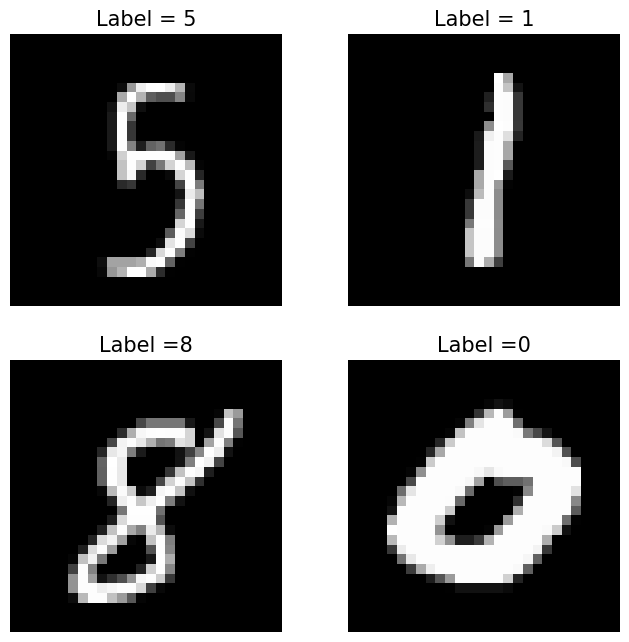

+++
title = 'Backpropagation by Hand: Understanding and Implementing an MNIST Classifier'
date = 2024-09-18T15:51:45-06:00
draft = false
+++

Welcome to my very first post of the blog! I wanted to take some time to brush up on ML foundations and what better way to learn (or re-learn) technical topics than to write up one's findings? I'm also hoping that treating these blog posts as final artifacts will be a useful forcing function for actually completing the projects.

Into the meaty content. In this post, I will walk through the implementation of a simple fully-connected neural network to tackle image classification on the [MNIST dataset](https://www.kaggle.com/datasets/hojjatk/mnist-dataset), which contains 70,000 28x28 pixel images of handwritten digits. I will implement backpropagation and stochastic gradient descent from scratch using `numpy` and provide high-level derivations and intuition for computing weight updates of each of the neurons, but I'll try not to get overly academic with it. This was a fun and surprisingly challenging exercise, and it made me even more thankful that mature automatic differentiation libraries like `pytorch` exist - I imagine that manually computing gradients for a 30+ layer ResNet would entail a special kind of masochism.

<!-- ## Loading the Dataset

Let's start off by loading the train and test datasets from the `torchvision` python package. While we won't be using `pytorch` for training, we will make use of the `DataLoader` class for sampling minibatches from the training dataset.

```python
from torch.utils.data import DataLoader
from torchvision import datasets, transforms

transform = transforms.Compose([
    transforms.Resize((28, 28)),
    transforms.ToTensor(),  # Ensure fast so no action is needed
])

# Fetch the dataset
train_dataset = datasets.MNIST(root='./data', train=True, transform=transform, download=True)
test_dataset = datasets.MNIST(root='./data', train=False, transform=transform, download=True)

train_loader = DataLoader(train_dataset, batch_size=64, shuffle=True)
test_loader = DataLoader(test_dataset, batch_size=1000, shuffle=False)
```
 -->

## MNIST Digit Classification

<!--  Following this for notation: https://cs230.stanford.edu/files/Notation.pdf -->

Let's begin by laying some notational groundwork for the MNIST classification task. As usual for supervised learning problems, we consider the setting where we are provided a dataset $\mathcal{D}$ consisting of input vectors $x$ and label vectors $y$:

$$\mathcal{D} = \bigl\lbrace (x^{(i)}, y^{(i)}) \bigr\rbrace_{i=1}^m, $$ 

where $m$ is the number of samples in our dataset. The standard MNIST dataset consists of 60,000 training images and 10,000 test images, which we will call $\mathcal{D_{\text{train}}}$ and $\mathcal{D_{\text{test}}}$. An image can be represented as a column vector:

$$x^{(i)} = [x_1^{(i)}, x_2^{(i)}, ..., x_{n_x}^{(i)}]^T,$$

where $n_x = 28 \times 28$ is the number of pixels in each image. Each image has a real-valued label $y^{(i)} \in [0, 9]$ that indicates which digit, or class, the image corresponds to. To help us perform classification, we will represent this as a one-hot encoded vector:

<!--  TODO: switch to Mathjax here -->
$$y^{(i)} = [y_1^{(i)}, y_2^{(i)}, ..., y_{n_y}^{(i)}]^T,$$ where $n_y = 10$ is the number of digits or classes to choose from and 

$$
y_j^{(i)} = \begin{cases}
1 & \text{if class } j \text{ is the correct class}, \\\\\\
0 & \text{otherwise}.
\end{cases}
$$

Below we can see some sample images from this dataset, along with their corresponding labels.

<!-- $$ 
\mathcal{D} = \mathcal{D_{\text{train}}} \cup \mathcal{D_{\text{test}}} = \lbrace (\boldsymbol{x}_i, \boldsymbol{y}_i) \mid i = 1, 2, ..., m \rbrace.
$$ -->



Because we have multiple digits to choose from, we consider this a **multi-class classification** problem, where the goal is roughly to find some function $f(x)$ that is able to correctly determine the labels for as many images in our dataset (or more precisely, our test set) as possible.

## Neural Network Definition

Most of you are probably familiar enough with neural networks that I can skip a conceptual introduction. Instead, I will move into defining the neural network as a mathematical function, so that we can work with each part for our backprop derivations.

Let $f(x; \theta)$ be the classification function (model) parameterized by $\theta$, which outputs the predicted label $\hat{y}^{(i)} = \arg\max_c f_c(x^{(i)}; \theta)$, where $f_c(x^{(i)}; \theta)$ is the score or probability for class $c$. This function $f_c$ is what we will be modeling with our neural network.

<!-- $$f: \mathbb{R}^{n_x} \rightarrow \mathbb{R}^{n_y}.$$ -->

While neural networks may have an abritrary number of layers (hence the name *deep* learning), we will use a network with a single hidden layer of size 128. The output of this hidden layer is:

$$h = \sigma (W_h x + b_h),$$

where $W_h \in \mathbb{R}^{n_h \times n_x}$ is the hidden layer's weight matrix, $b_h \in \mathbb{R}^{n_x}$ is the bias vector, $n_h = 128$ is the hidden layer size, and $\sigma$ is the sigmoid activation function. The dimensions of each matrix and vector become quite important during implementation - shape errors tend to be where I spend much of my debugging time in the early stages of a project.

For classification problems where a single label is predicted, it is typical to use the softmax function to convert the final layer outputs into a probability distribution:

$$\text{softmax}(z) = \frac{e^{z}}{\sum_{j=1}^{C} e^{z}_{j}}.$$

With this, the final output of our neural network becomes:

$$f_c(x^{(i)}; \theta) = \text{softmax} (W_o h + b_o),$$

where $W_o \in \mathbb{R}^{n_y \times n_h}$ and $b_o \in \mathbb{R}^{n_y}$ are the *output* layer's weight matrix and bias vector, respectively.

Pictorally, our network looks something like this... TODO

<!-- Our neural network will consist of a single hidden layer, where each node in the hidden layer applies an activation function to a weighted sum of the inputs. The choice of activation function is crucial, as it introduces non-linearity to the model, enabling it to learn complex patterns. -->

And here is my implementation of a fully-connected neural network (i.e. FCNetwork) in python:

```python
import numpy as np

def sigmoid(x):
    return 1 / (1 + np.exp(-x))

def softmax(z):
    exp_z = np.exp(z - np.max(z, axis=1, keepdims=True))  # Subtract max(z) for numerical stability
    return exp_z / exp_z.sum(axis=1, keepdims=True)

class FCNetwork():
    """Single hidden layer network"""
    def __init__(self, input_dim, hidden_dim, output_dim, activation=sigmoid):
        self.w1 = np.random.randn(input_dim, hidden_dim) * np.sqrt(1. / input_dim) # d x h
        self.w2 = np.random.randn(hidden_dim, output_dim) * np.sqrt(1. / hidden_dim) # h x 10
        self.b1 = np.random.rand(1, hidden_dim) # 1 x h
        self.b2 = np.random.rand(1, output_dim) # 1 x 10
        self.activation = activation

    def forward(self, X):
        batch_size = X.shape[0]
        X = X.reshape((batch_size, -1))
        z1 = np.dot(X, self.w1) + self.b1
        h = self.activation(z1)
        z2 = np.dot(h, self.w2) + self.b2
        f_c = softmax(z2)
        return z1, h, z2, f_c
    
    def predict(self, X):
        _, _, _, f_c = self.forward(X)
        y_hat = np.argmax(f_c, axis=1)
        return y_hat
```

 The `forward` function returns a vector of softmax distributions $f_c$ for a batch of samples `X`, along with other variables that will be useful for backpropagation, while the `predict` function returns a vector of predicted classes $\hat{y}^{(i)}$.

<!-- ## Defining the Loss Function -->

<!-- For our classification task, we’ll use the **cross-entropy loss**, which is a common choice for multi-class classification problems. It measures the difference between the predicted probability distribution and the true distribution (one-hot encoded labels for MNIST). The cross-entropy loss for a batch of samples is defined as:

$$
L = - \frac{1}{N} \sum_{n=1}^{N} \sum_{i=1}^{K} y_i^{(n)} \log(\hat{y}_i^{(n)})
$$

### Python Code for Cross-Entropy Loss:
```python
def cross_entropy_loss(y, y_hat):
    # Small epsilon added to avoid log(0)
    epsilon = 1e-12
    y_hat = np.clip(y_hat, epsilon, 1. - epsilon)  # Ensure y_hat is within (0, 1) to prevent log(0)
    
    # Average over the batch
    return -np.sum(y * np.log(y_hat)) / y.shape[0]
```

In this function, we first clip the predicted values y_hat to avoid undefined values from log(0) and then compute the average loss over the batch of examples. -->

## Gradient Descent with Backpropagation

We now have a parameterized model that is capable of representing a set of functions $\mathcal{H}$, which is often called the **hypothesis space**. Our goal is to find a function $f \in \mathcal{H}$ which provides the best fit with respect to our dataset $\mathcal{D}$. To accomplish this, we will define a **loss function** $J(x, \theta)$ as a measure of fit, and then *minimize* this function to find the optimal parameters of the model:

$$\theta_* = \arg\min_{\theta} J(x, \theta).$$

For multi-class classification problems, cross-entropy is a common loss function which measures the distance between the predicted probability distribution $\hat{P}(y|x)$ and the true distribution $P(y|x)$. The cross-entropy loss for a batch of samples is defined as:

$$
J(x, \theta) = - \frac{1}{N} \sum_{i=1}^{N} \sum_{j=1}^{K} y_j^{(i)} \log(\hat{y}_j^{(i)}(x; \theta)),
$$

where $N$ is the batch size and $K = n_y$ is the number of classes.


Next up, we implement **backpropagation**, which is the algorithm that allows the model to update its weights based on the gradient of the loss function with respect to each parameter. This is done using the chain rule of calculus to propagate the error from the output layer back to the input layer.


TODO: derive update rules

### Python Code for Backpropagation:
```python
def backprop(X, y, model, learning_rate=0.01):
    # Forward pass
    y_hat = model.forward(X)
    
    # Compute the error at the output layer
    dz2 = y_hat - y  # (batch_size, 10)
    dw2 = np.dot(model.a1.T, dz2) / X.shape[0]
    db2 = np.sum(dz2, axis=0, keepdims=True) / X.shape[0]
    
    # Compute the error at the hidden layer
    dz1 = np.dot(dz2, model.w2.T) * sigmoid_derivative(model.z1)
    dw1 = np.dot(X.T, dz1) / X.shape[0]
    db1 = np.sum(dz1, axis=0, keepdims=True) / X.shape[0]
    
    # Update weights and biases
    model.w2 -= learning_rate * dw2
    model.b2 -= learning_rate * db2
    model.w1 -= learning_rate * dw1
    model.b1 -= learning_rate * db1
```

The backpropagation algorithm updates the weights (w1 and w2) and biases (b1 and b2) by computing the gradients of the loss with respect to each parameter. These gradients are used to adjust the parameters in the direction that reduces the loss, as governed by the learning rate.

## Evaluating Performance

After training the model, we want to evaluate how well it generalizes to unseen data (our test set). The accuracy metric is a simple yet effective measure, especially for classification tasks like MNIST.

### Python Code for Accuracy:
```python
def accuracy(y_true, y_pred):
    y_true_labels = np.argmax(y_true, axis=1)
    y_pred_labels = np.argmax(y_pred, axis=1)
    return np.mean(y_true_labels == y_pred_labels)
```

Here, we convert the one-hot encoded labels and predictions into their respective class indices using argmax, and then compute the percentage of correctly predicted examples.

## Training the Model

We can now tie everything together in a training loop. The model will iterate over the training data, compute the loss, backpropagate the errors, and update its parameters.

### Python Code for Training Loop:

```python
epochs = 10
learning_rate = 0.01

for epoch in range(epochs):
    for batch_idx, (X_batch, y_batch) in enumerate(train_loader):
        X_batch = X_batch.view(X_batch.size(0), -1).numpy()  # Flatten the input images
        y_batch_onehot = np.eye(10)[y_batch.numpy()]  # Convert labels to one-hot encoding
        
        # Forward and Backpropagation
        backprop(X_batch, y_batch_onehot, model, learning_rate)
    
    # Test performance on test set
    test_X = test_loader.dataset.data.view(-1, 28*28).numpy()
    test_y = np.eye(10)[test_loader.dataset.targets.numpy()]
    test_predictions = model.forward(test_X)
    test_accuracy = accuracy(test_y, test_predictions)
    print(f"Epoch {epoch+1}/{epochs} - Test Accuracy: {test_accuracy:.4f}")
```

This loop trains the model for a set number of epochs, where each epoch processes the entire dataset. After each epoch, we compute the accuracy on the test dataset.

## Debugging

Training a neural network from scratch can often result in a few hiccups along the way, including issues like vanishing gradients, slow convergence, or poor generalization. A few debugging tips:

Check the learning rate: If the model is not improving, the learning rate may be too high or too low.
Inspect gradients: If the weights are not updating properly, inspect the gradients and make sure they are neither too large nor vanishingly small.
Try different activations: Sigmoid can suffer from saturation in deep networks. Experiment with ReLU or Leaky ReLU if needed.

## Conclusion

In this post, we’ve implemented a fully connected neural network from scratch using NumPy, trained it using stochastic gradient descent and backpropagation, and tested it on the MNIST dataset. This foundational understanding will be useful as we move to more advanced architectures.

Next, we’ll take on the challenge of implementing a **convolutional neural network (CNN)** to tackle a more complex dataset, the CIFAR-10, where image recognition becomes more nuanced.

Stay tuned!